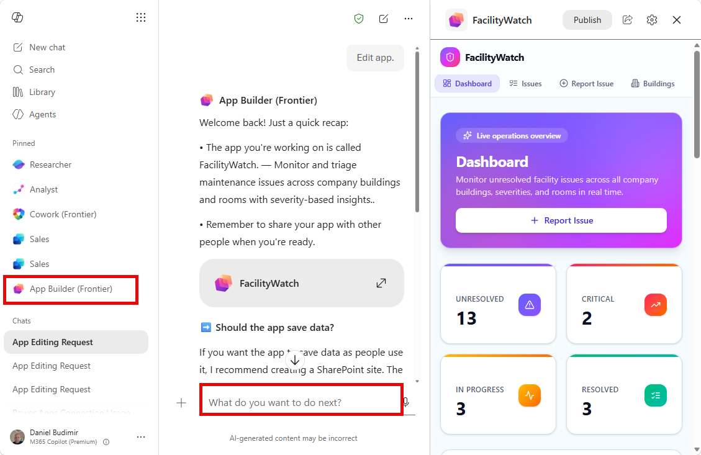
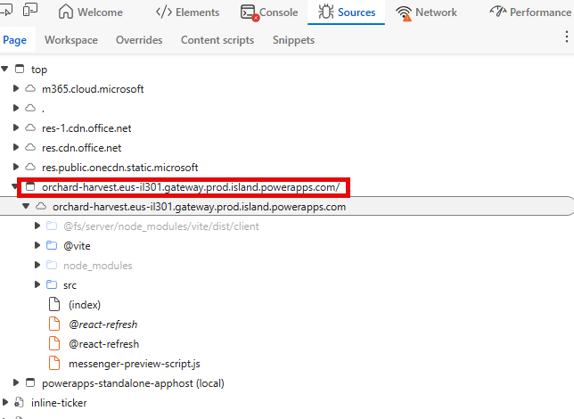
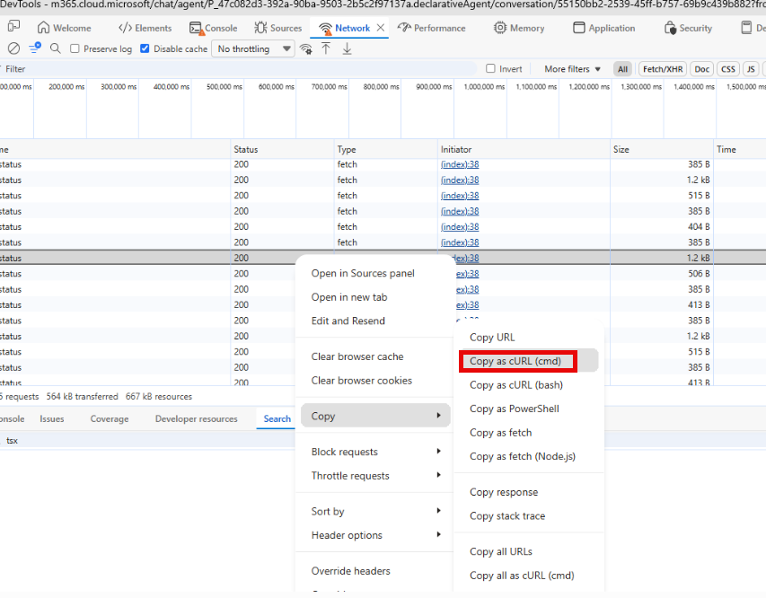
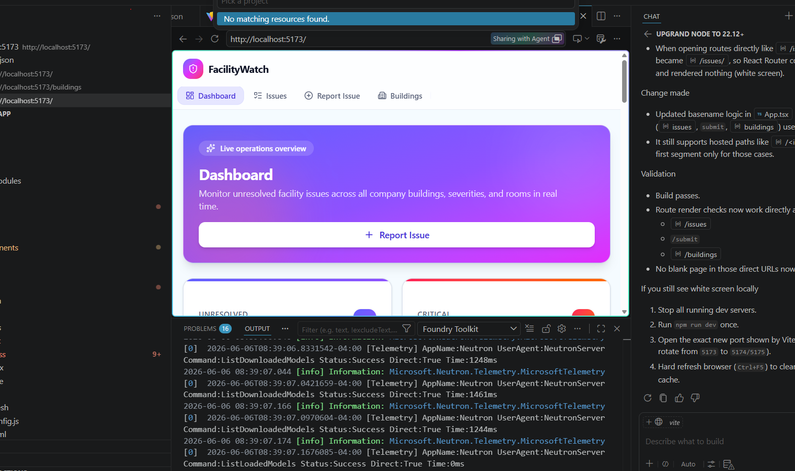
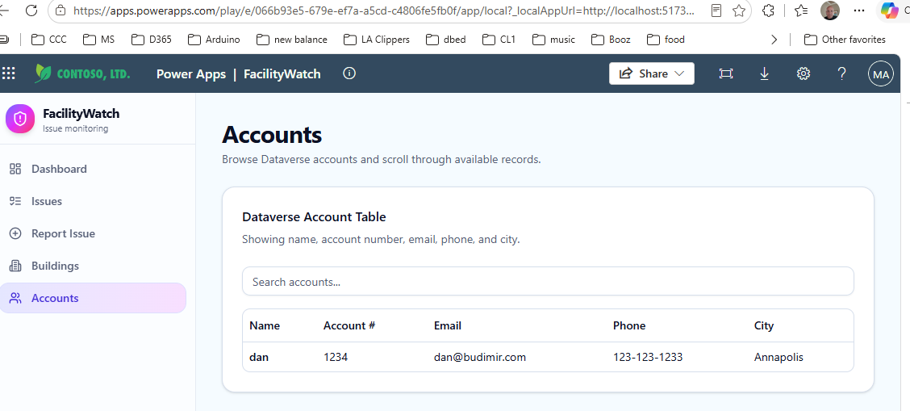
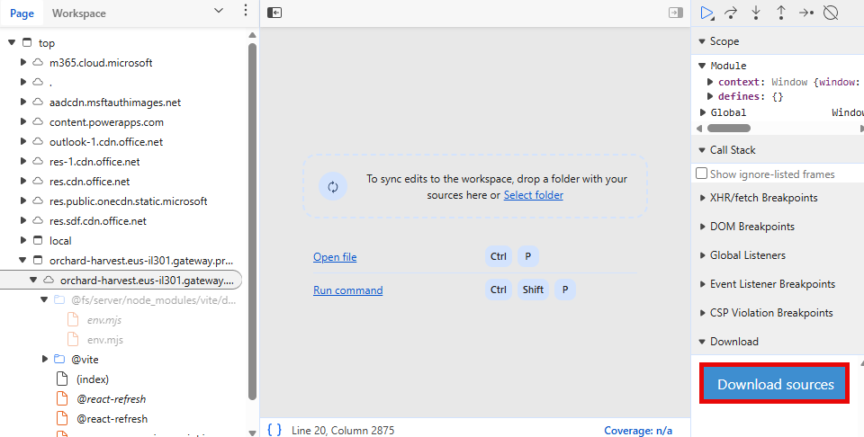

# Turning an M365 App Builder App into a Power Apps Code App using GitHub Copilot

You've vibed a cool app in **Microsoft 365 App Builder**, but now you want to run it locally in Node, after that you want scaffold it as a **Power Apps Code App** so you can connect to Oracle, SQL Server, Snowflake, Custom connectors, etc.

This guide documents how to take a live app built with the **Microsoft 365 App Builder** — extract its React/TypeScript source, and merge it into a **Power Apps Code App** Vite template. The end result is a fully working local project integrated with the Power Apps SDK, wired to Dataverse, and runnable inside the Power Apps host via Local Play.

This entire exercise, start to finish, was done using GitHub Copilot in VS Code, no manual intervention was required other than a natural language conversation and on one occasion providing a reference from the DevTools Network tab so the CLI had a token it could use to authenticate.

---

## Prerequisites

| Tool | Version | Why |
|------|---------|-----|
| VS Code | latest | Gotta have that... |
| GitHub Copilot (CLI) | latest | Gotta have that as well... |
| Node.js | ≥ 18 | Runtime for Vite dev server |
| npm | ≥ 9 | Package manager |
| [Power Platform CLI (pac)](https://learn.microsoft.com/en-us/power-platform/developer/cli/introduction) | latest | `pac code init`, auth |
| Browser DevTools | any | Authenticated asset extraction |

---

## Background

The starting app was built with the **M365 App Builder** and hosted at a Power Apps gateway URL:

```
https://orchard-harvest.<your-app-identifier>.gateway.prod.island.powerapps.com
```

In order to get this URL you must first **Edit** the app in M365 Copilot.  Only edit mode will expose the endpoint that houses the HTML, TypeScript, CSS, etc. files.  While vibing (editing), the TypeScript files are dynamically updated and compiled to JavaScript, when you **Play** the app, the TypeScript files have already been compiled and are not visible.



Hit F12 in your browser to open DevTools, click on the sources tab, find the source that begins with orchard-harvest. This is the endpoint needed to start the conversation.



There is a manual way to initially get the code if you don't want to let CLI handle it. [The other way to get the code...](#the-other-way-to-get-the-code).

**Rubber hits the road here**

```
Me: Can you import all of the files for this Vite app?
https://orchard-harvest.<your-app-identifier>.gateway.prod.island.powerapps.com/
```
There was some back and forth with the CLI; it was trying to get to the endpoint but was getting a 401 and needed authentication. It eventually asked me to Open **DevTools → Network** tab and find a successful request to this gateway, **Copy as cURL** then paste that into the CLI. 



After that it was just a conversation, the CLI had all it needed to download the app and make the needed modifications to eventually get to a fully functional Node app running on my local machine.

```
CLI: If you want, I can now clean this into a runnable local Vite project structure by generating missing config files from the imported source and wiring npm scripts.

Me: yes, do that, then run the app
```
Initially the screen was not populating, so I told CLI

```
I see a white screen, fix it.
```

So it did.



---

## Add code app scaffolding

```
**Me:** I want to make this into a Power Apps Code App. Using this template, can you integrate only what is needed from the template so I can run this in power platform?
https://github.com/microsoft/PowerAppsCodeApps/tree/main/templates/vite

**CLI**: Done. If you want, I can next add a minimal data-source connection setup flow (connection references in power.config.json) so you can bind real Power Platform data instead of local in-memory services.

**me**: yes

**CLI**: If you want, I can do the next step for you now and add a specific Dataverse table (for example account or your custom building/room/issue tables) directly.

**me**: yes, use account

**CLI**: If you want, I can add the next tables the same way (for example contact, or your custom building, room, issue Dataverse tables if they already exist).

**me**: you've added account to the available datasources. can you add a tab to the app and a few fields from account and allow me to scroll through the available accounts in the table?

**CLI**: Implemented. You now have an Accounts tab that loads and scrolls through Dataverse account records.
```



---
## tl;dr (This was all written by CLI, I've left it here purely for reference and morbid curiosity)

The key packages that distinguish a Code App from a plain Vite app:

| Package | Purpose |
|---------|--------|
| `@microsoft/power-apps` | Runtime SDK — `getClient`, connectors, auth |
| `@microsoft/power-apps-vite` | Vite plugin — CORS, `power.config.json` endpoint, Local Play URL |

---

## Step 3 — Merge the App Source into the Code App Template

Paste or place the recovered `.tsx` / `.ts` / `.css` files into `src/`, replacing the template's placeholder pages. The typical structure you'll find in an App Builder app (which maps cleanly onto the Code App template structure):

```
src/
  main.tsx           # entry point
  App.tsx            # router root
  pages/
    _layout.tsx      # nav shell
    index.tsx        # dashboard
    issues.tsx
    buildings.tsx
    submit.tsx
  api/
    models/          # TypeScript types
    services/        # data fetching
  components/        # shared UI components
  hooks/             # React Query hooks
```

Fix any TypeScript errors you hit at this stage (common ones: `d3` type imports, `@types/node` missing, strict null checks).

---

## Step 4 — Wire the Power Apps Vite Plugin

Update `vite.config.ts`:

```ts
import { defineConfig } from 'vite';
import react from '@vitejs/plugin-react';
import { fileURLToPath, URL } from 'node:url';
import { powerApps } from '@microsoft/power-apps-vite/plugin';

export default defineConfig({
  plugins: [react(), powerApps()],
  resolve: {
    alias: {
      '@': fileURLToPath(new URL('./src', import.meta.url)),
    },
  },
});
```

The `powerApps()` plugin does three things automatically:
- Sets Vite's `base` to `./` for correct asset paths in the host.
- Adds CORS headers needed by `apps.powerapps.com`.
- Prints the **Local Play URL** when you start the dev server.

---

## Step 5 — Initialize Power Apps Config

Run this once in your project root to create `power.config.json`:

```bash
pac auth create --environment <your-environment-id>
pac code init
```

`power.config.json` stores your environment ID, app display name, region, and datasource references. It's read at runtime by the Power Apps host.

---

## Step 6 — Add a Dataverse Datasource

To query Dataverse tables (e.g. `account`), add a datasource reference:

```bash
npx power-apps add-data-source
```

Follow the prompts: select your environment → select the table (e.g. **Accounts**). This adds an entry to `power.config.json`:

```json
"databaseReferences": {
  "default.cds": {
    "dataSources": {
      "accounts": {
        "entitySetName": "accounts",
        "logicalName": "account",
        "isHidden": false
      }
    }
  }
}
```

Then create a service file to call it:

```ts
// src/api/services/AccountsService.ts
import { getClient } from '@microsoft/power-apps/data';

export const AccountsService = {
  getAll: async (top = 200) => {
    const client = getClient('accounts');
    const result = await client.getItems({
      $top: top,
      $select: 'name,accountnumber,emailaddress1,telephone1,address1_city',
    });
    return result.value;
  },
};
```

> **Note:** `getClient` only works when the app runs inside the Power Apps host (Local Play or published). It will error on plain `localhost` — this is expected.

---

## Step 7 — Fix React Router for the Power Apps Host

The Power Apps host embeds your app at a URL that includes a path prefix (e.g. `/buildings`). React Router's `basename` must match this prefix exactly — no trailing slash — or you get a blank white screen.

In `App.tsx`, compute basename from the first URL segment:

```tsx
function getBase(pathname: string): string {
  const parts = pathname.replace(/^\//, '').split('/').filter(Boolean);
  return parts.length ? `/${parts[0]}` : '/';
}

// Inside your component:
const [base] = useState(() => getBase(window.location.pathname));

return (
  <BrowserRouter basename={base}>
    {/* routes */}
  </BrowserRouter>
);
```

The key is `/${parts[0]}` — **no trailing slash**. A trailing slash causes a mismatch between the basename and the actual URL, which silently renders nothing.

---

## Step 8 — Run Locally

### Option A — Vite only (UI testing, no Dataverse)

```bash
cd my-codeapp
npm run dev
```

Open `http://localhost:5173/`.

### Option B — Power Apps Local Play (full host + Dataverse)

You need two processes running simultaneously:

**Terminal 1** — Vite dev server:
```bash
npm run dev
```
Note the **Local Play URL** printed in the console by the plugin.

**Terminal 2** — Power Apps connection proxy:
```bash
npx power-apps run
```
This starts a connection broker on `http://localhost:8080` that the host uses to authenticate Dataverse calls.

The canonical Local Play URL looks like:
```
https://apps.powerapps.com/play/e/<environmentId>/app/local?_localAppUrl=http://localhost:5173&_localConnectionUrl=http://localhost:8080
```

Open that URL in your browser, sign in, and your app runs inside the Power Apps host with live Dataverse access.

---

## Common Issues

| Symptom | Cause | Fix |
|---------|-------|-----|
| White screen on direct URL | Router basename has trailing slash | Remove trailing slash from `getBase` return value |
| `"This app isn't working"` in host | Using plugin URL instead of `power-apps run` URL | Use the URL from `npx power-apps run` output |
| `ENOENT: C:\package.json` | npm run from wrong directory | Always run from `my-codeapp/`, not the parent |
| `getClient` throws outside host | Called on plain `localhost` without host context | Expected — test Dataverse features via Local Play only |
| Port 5173 in use | Old Vite process still running | `npm run dev -- --port 5174` or kill the old process |

---

## Result

At the end of this process you have:

- A fully editable local TypeScript/React source tree
- Hot-reload dev server via Vite
- Real Dataverse data in the Power Apps host via Local Play
- A foundation to add new pages, tables, and Power Platform connectors

---

## References

- [Power Apps Code Apps overview](https://learn.microsoft.com/en-us/power-apps/maker/canvas-apps/code-components-overview)
- [pac CLI reference](https://learn.microsoft.com/en-us/power-platform/developer/cli/reference/code)
- [@microsoft/power-apps npm](https://www.npmjs.com/package/@microsoft/power-apps)
- [@microsoft/power-apps-vite npm](https://www.npmjs.com/package/@microsoft/power-apps-vite)
- [React Router v6 basename](https://reactrouter.com/en/main/router-components/browser-router#basename)


## The other way to get the code...
1. Install **DevTools - Sources downloader** into your browser (works in Edge or Chrome). 
https://chromewebstore.google.com/detail/devtools-sources-download/hhfkbeloejjheeiihhjndfcogjhejoek
2. In **Edit** mode, hit F12 to see the dev tools.
3. Click the **Sources** tab to ensure you see **orchard-harvest**.
4. Click **Download sources**, the sources.zip file will eventually show up in your downloads folder.

5. Standard Windows zip tools were not working to opehn the file so I used WinRAR.
6. Extract all files from the root of the **orchard-harvest** folder to a folder.
7. Open the folder with VS Code and let CLI take it from there.


